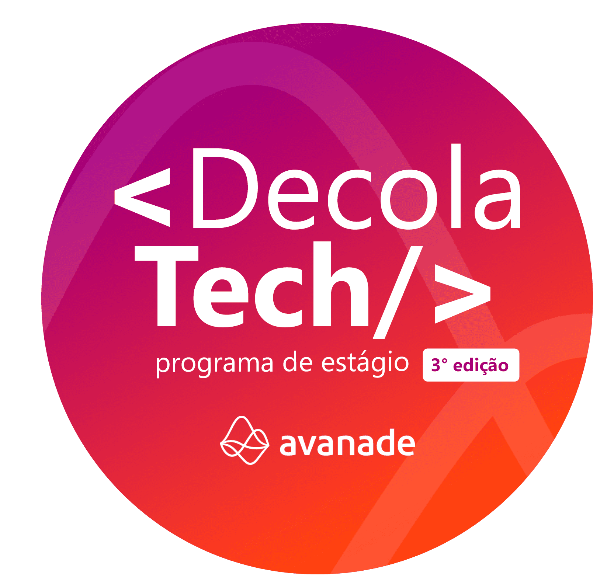

## Decola Tech 2025 - Bootcamp Avanade
<h1 align="center">
    
</h1>

  <a href="#authors">Autor</a>&nbsp;&nbsp;&nbsp;|&nbsp;&nbsp;&nbsp;
  <a href="#about">Sobre o Bootcamp</a>&nbsp;&nbsp;&nbsp;|&nbsp;&nbsp;&nbsp;
  <a href="#about">Projetos</a>&nbsp;&nbsp;&nbsp;|&nbsp;&nbsp;&nbsp;
  <a href="#tech_utilizadas">Tecnologias utilizadas</a>&nbsp;&nbsp;&nbsp;

Este repositório contém os projetos desenvolvidos durante o bootcamp Decola Tech Avanade 2025, focado em Spring Boot, Angular, e tecnologias de Inteligência Artificial. O bootcamp tem como objetivo capacitar os participantes para o desenvolvimento de aplicações full-stack, com foco em criar APIs REST, integrar sistemas com banco de dados, e explorar serviços de nuvem e IA.

## ✍️ Autor:  
-  [Vinicios Mucheirone](https://www.linkedin.com/in/viniciosmucheirone/)

## 📝 Sumario de Projetos
- [Publicando Sua API REST na Nuvem Usando Spring Boot 3, Java 17 e Railway](https://github.com/viniciosmucheirone/DIO-Bliblioteca-API)
- [Criando seu Board de tarefas com Java](https://github.com/viniciosmucheirone/DIO-Board-Java)
- [Criando um Blog com Angular](#authors)
- [Criando um APP Full Stack de Agendamento de Barbearia com Java e Angular](#authors)
- [Criando um clone do BuzzFeed com Angular](#authors)
- [Azure Cognitive Search: Utilizando AI Search para indexação e consulta de Dados](#authors)
- [Análise de Sentimentos com Language Studio no Azure AI](#authors)
- [Explorando os Recursos de IA Generativa com Copilot e OpenAI](#authors)

# 🗺️ Sobre o Bootcamp:

O Decola Tech Avanade 2025 oferece uma jornada de aprendizado imersiva com mentorias ao vivo, desafios práticos, e construção de um portfólio sólido. A proposta do bootcamp é capacitar os participantes para que possam atuar como desenvolvedores full-stack, explorando tecnologias emergentes como Spring Boot, Angular, e Azure.

Objetivo do Repositório:
Este repositório serve como um local de armazenamento e compartilhamento dos projetos realizados durante o bootcamp, permitindo que outros participantes e recrutadores visualizem o progresso e as habilidades adquiridas ao longo do programa.

# 📊 Projetos 

## Projeto 1 - [Publicando uma API REST na Nuvem Usando Spring Boot 3, Java 17 e Railway](https://github.com/viniciosmucheirone/DIO-Bliblioteca-API)
- Neste projeto, desenvolvi uma API REST utilizando Java 17 e Spring Boot 3, com integração a banco de dados via Spring Data JPA. O objetivo foi criar uma aplicação simples e funcional, com endpoints bem definidos para gerenciar recursos específicos. A API foi implementada com o foco em boas práticas de desenvolvimento e documentação.

## Projeto 2 - [Criando um Board de tarefas com Java](https://github.com/viniciosmucheirone/DIO-Board-Java)
- Neste projeto, desenvolvi uma aplicação de gerenciamento de tarefas utilizando Java, com foco nas melhores práticas de desenvolvimento. O objetivo foi criar um board de tarefas funcional, passando por todas as etapas do processo, desde o planejamento e estruturação até a implementação de funcionalidades como gerenciamento de dados e integração entre camadas. A aplicação foi desenvolvida seguindo as melhores práticas de programação e boas práticas de design de software.

## Projeto 3 - [Criando um Blog com Angular]()
- To-do

## Projeto 4 - [Criando um APP Full Stack de Agendamento de Barbearia com Java e Angular]()
- To-do

## Projeto 5 - [Criando um clone do BuzzFeed com Angular]()
- To-do

## Projeto 6 - [Análise de Sentimentos com Language Studio no Azure AI]()
- To-do

## Projeto 7 - [Azure Cognitive Search: Utilizando AI Search para indexação e consulta de Dados]()
- To-do

## Projeto 8 - [Explorando os Recursos de IA Generativa com Copilot e OpenAI]()
- To-do

## ⛏️ Tecnologias utilizadas: 
- JAVA 17
- Apache Maven
- Hibernate
- Spring
- Spring Boot 3
- Spring Data JPA
- Swagger/OpenAPI
- Railway (para Deploy na Nuvem)

# 💾 Links uteis 

- JAVA https://www.oracle.com/br/Java/
- MySQL https://www.mysql.com/
- Apache Maven https://maven.apache.org/
- Hibernate https://hibernate.org/
- Spring https://spring.io/

